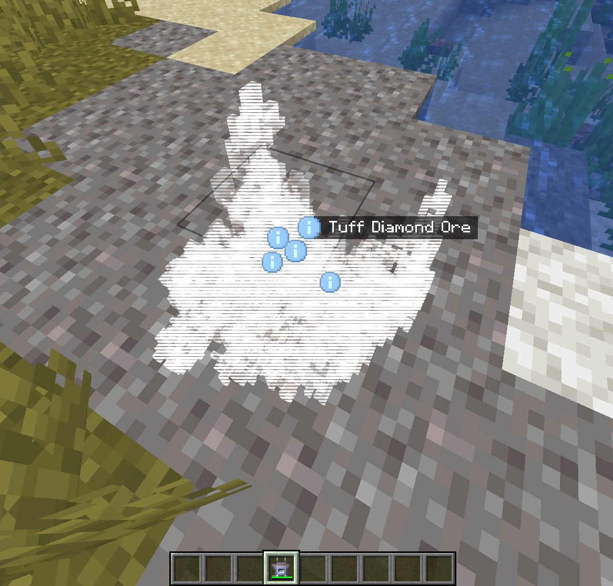
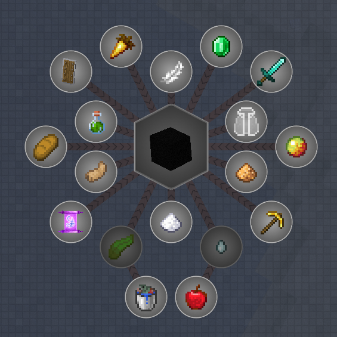
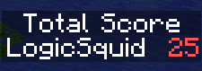
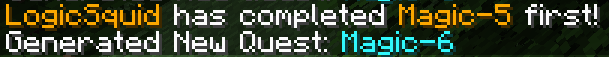
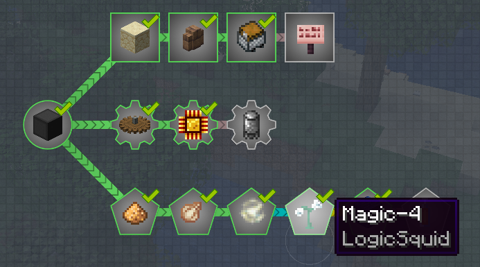
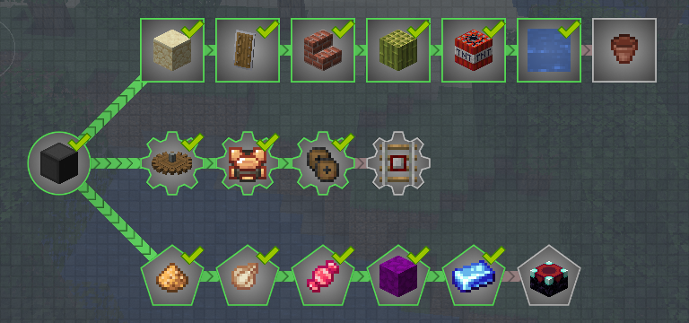

# Moving is Tuff

Item Teleportation? Player Teleportation? Who needs 'em.

This pack spawned from the idea that modded minecraft worlds tend to have very localized infrastructure. Making certain aspects of some mods (i.e. Create Trains) a less attractive way to transport items around your world.

By eliminating most easy forms of modded item/player teleportation this pack hopes that players will come up with more creative and entertaining ways of getting items from Point A to Point B.

Several questlines, both static and dynamic, have also been added to incentivize gathering huge amounts of resources. 

## Core Gameplay Changes/Additions
### Changes
  - **End Portals/Strongholds:** We have removed endportals to change the gameplay route to the end.
  - **Changed Recipes:** Several recipes have been changed to make them a bit harder or gate them behind interdimensional travel. 
    - See JEI for AE2, Botania, CC, etc.
  - **Removed Items:** Some items have been removed so as to stick more closely to the theme of *Moving is Tuff*

### Additions/Quests
  - **Large Ore Deposits:**
    - Large ore deposits of Tuff Ores have been added that can be found with the Scanner/Tuff Ores Scanner Module
    - These veins are targeting an average of 1 Million raw ore per vein spread out over ~7500 blocks per vein.
    - Tuff Ores are very difficult to mine and are intended to be mined via Create or other modded means.
    - 

        
<u>Large Ore Deposit Example</u>

        
      

    

  - **Player Upgrades:**
    - Completing quests in the `Player Upgrades` chapter will grant you potion filters from the Pylons mod that can be placed in a pylon to provide permanent potion effects.
    - 

      
<u>Player Upgrades</u>

        
      
    

  - **Dynamic Questing:** 
    - We've added 3 dynamic questlines (Vanilla, Tech, Magic) that when completed, will generate a random new quest in the same line.
      - Every playthrough will be different!
    - Each quest completed will give your FTB team +1 point to its respective scoreboard and +1 to your total score
      
      
    - The first team to complete a quest will get its team name added to the quest's subtitle. The team will also recieve +1 to the `First Completions` scoreboard. An announcement will be displayed in chat to let everyone know of your achievement!
    
      
    - 

        
<u>Dynamic Questing Examples</u>

        
        
        
      

